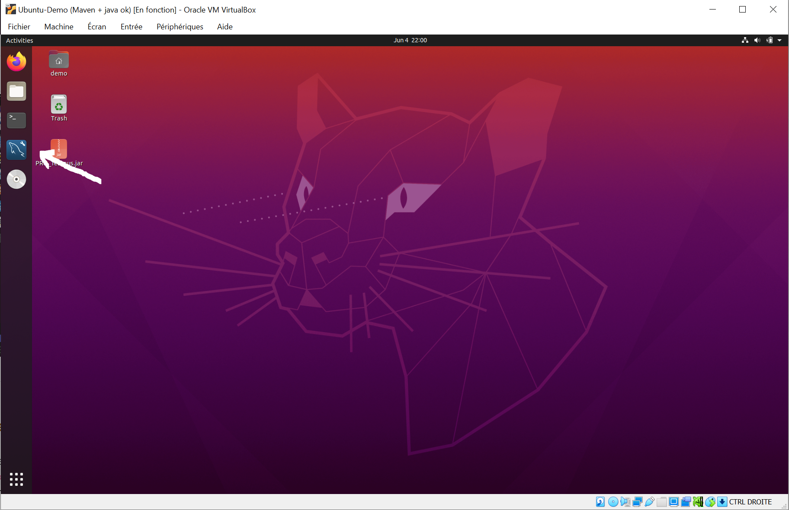
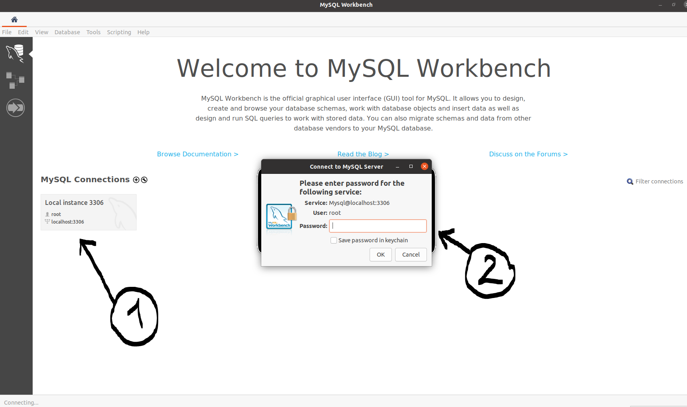
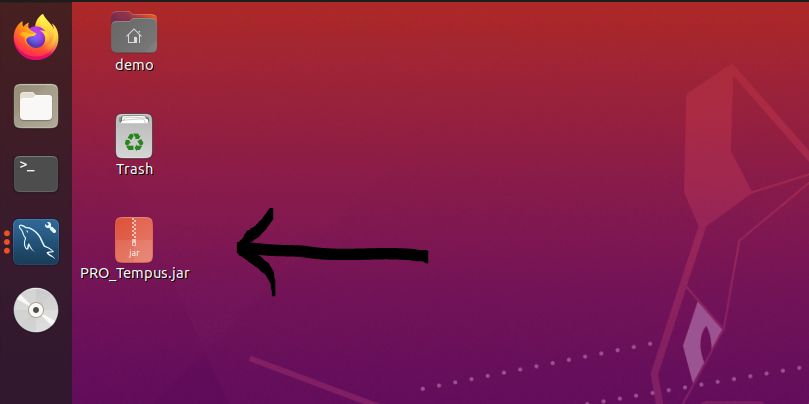
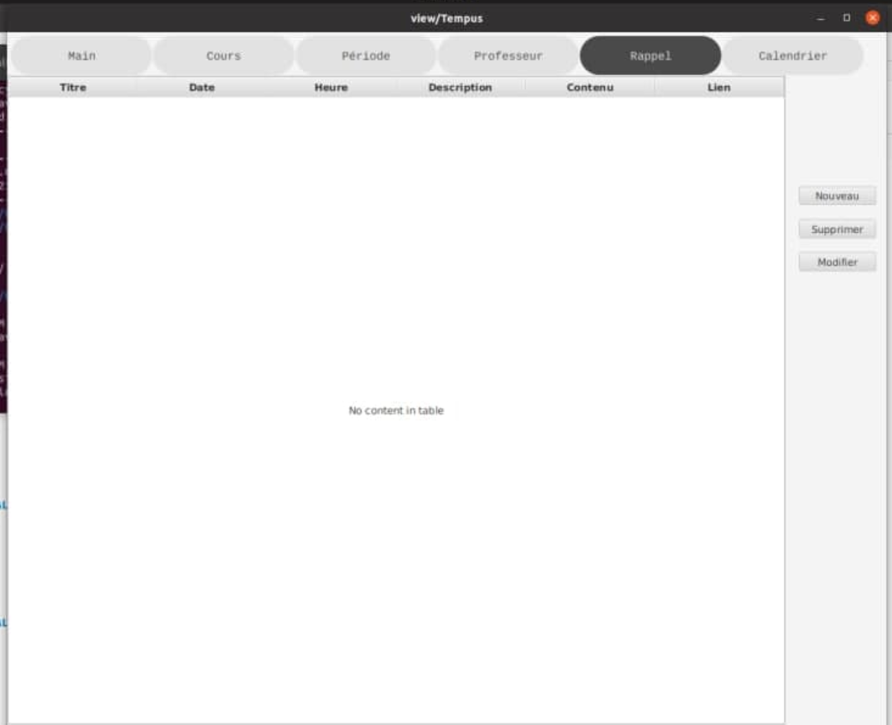
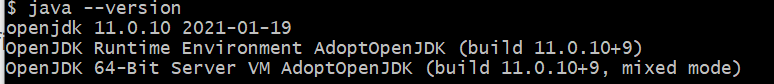
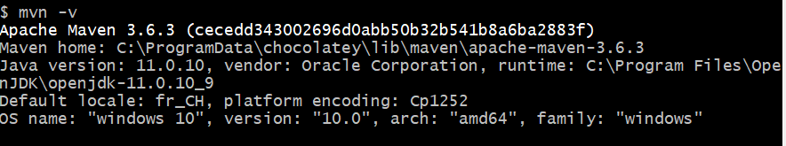
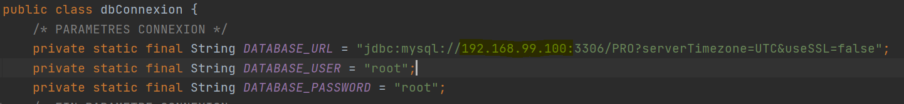

# Tempus
<p align="center">
  
</p>

[](https://github.com/AcademyHeig-vd/PRO-Project/actions/workflows/maven.yml)
[](http://ansicolortags.readthedocs.io/?badge=latest)
[](https://GitHub.com/Naereen/StrapDown.js/tags/)
[](https://lbesson.mit-license.org/)
[](https://github.com/ellerbrock/open-source-badges/)


Google drive : https://drive.google.com/drive/folders/16hgVjggeGgG7rjfjVIXN8Mohfn_XSWHI

# Procédure d'installation

Afin d'installer ou tester l'application PRO_Tempus, vous aurez trois choix d'installations possible :

1. Utiliser une VM avec tous les outils déjà configuré (recommandé pour un test). Difficulté d'installation simple.
2. Télécharger le fichier .jar et le fichier de base de donnée (JVE 11 + serveur sql local). Difficulté d'installation moyenne.
3. Récupérer les source du projets, et les compiler (Maven, JDK 11, Docker). Difficulté d'installation élevée.

## Avec Virtual box 

Afin d'essayer l'application via la VM. Il faudra avoir les capacités suivantes :

- Dernière version de VirtualBox installée.
- 15 GB disponible.
- 4Mo de mémoire et 2 processeur alloué, qui permettront une meilleures utilisation de la machine virtuelle.
- Avoir le temps de télécharger la machine virtuelle (1h~).

### Procédure d'installation

1. Télécharger la VM au lien suivant : https://drive.google.com/file/d/18SG981j57HEYCurmg1khtr6Q3E3WZH5c/view?usp=sharing
2. Double cliquer sur le fichier télécharger pour l'importer dans VirtualBox
3. Lancer la machine virtuelle
4. Installer les additions invité pour profiter de la VM en plein écran, puis redémarrer
5. Au redémarrage, il faut lancer `mysql-workbench`.
6. Ensuite, il faudra se connecter à MYSQLWorkbench avec l'utilisateur `root` avec le mot de passe `root`
7. à partir de là, vous pourrez double cliquer sur l'application PRO_Tempus.jar afin de démarrer l'application



7. L'application devrait s'allumer



### Problème d'installation

En cas de problème, veuillez contacter la personne en charge soit Axel Vallon au trois format possible avec : 

- Telegram (de préférence) : https://t.me/AxelVallon (temps de réponse très rapide)

- Mail : axel.vallon@heig-vd.ch (temps de réponse moyennement rapide)
- Téléphone en cas d'urgence : +41 78 936 16 12 (temps de réponse rapide)

## Installation avec le fichier jar

Il est possible d'utiliser l'application de manière standard en récupérant le fichier `.jar` final du projet. Cependant cette méthodes nécessite l'installation d'un serveur `mysql` local pour héberger l'application et l'installation d'une `jre` java de version 11 (OpenJDK ou Adobe)

### Procédure d'installation

1. Télécharger le fichier jar au lien suivant : https://drive.google.com/file/d/1zRnPzYBTyKtaegKFgcDiYI3h3erHbiH9/view?usp=sharing
2. Télécharger la base de donnée au lien suivant : https://github.com/AcademyHeig-vd/PRO_Tempus/blob/main/mysql/database/pro.sql

3. Configurer votre propre serveur sql local avec les paramètres suivants :
   1. Utilisateur : `root`
   2. Mot de passe : `root`
   3. Importer la base de donnée
4. Exécuter le programme avec `java -jar PRO_Tempus.jar`

### Problème d'installation

En cas de problème lors de cette installation, veuillez vérifier les points suivants :

- La version de java utilisée est bien la version 11. 
- La base de donnée est bien accessible avec `root`

## Installation avec les sources

### Prérequis

- Installation de java jdk 11

  

- Installation de maven

  

- Docker installé

- git installé (pas obligatoire)

### installation Windows

1. Cloner le projet https://github.com/AcademyHeig-vd/PRO_Tempus
2. Exécuter le script `./start`. Il va générer le serveur sql sur Docker, et ouvrir le port 3306 sur celui-ci.
3. Exécuter `mvn package -DskipTests`. Cette commande Maven va généré le fichier .jar avec toutes les libraires inclues dans celui-ci
4. Exécuter `java -jar target/PRO_Tempus-1.0-SNAPSHOT-Final`

### Installation Linux & MacOS avec Docker-Compose ou Docker Toolbox

1. Cloner le projet https://github.com/AcademyHeig-vd/PRO_Tempus

2. Exécuter 

   ```
   cd Docker
   sudo docker-compose up --build
   ```

3. Modifier dans l'adresse du serveur sql dans les source du projet 

   1. Fichier à modifier : `./src/main/java/ch/heigvd/pro/connexion/dbConnexion.java`
   2. Modifier l'adresse IP pour l'adresse utilisée par Docker-Compose.

4. Exécuter `mvn clean package`. Cette commande Maven va générer le fichier .jar avec toutes les libraires inclues dans celui-ci

5. Exécuter `java -jar target/PRO_Tempus-1.0-SNAPSHOT-Final`


